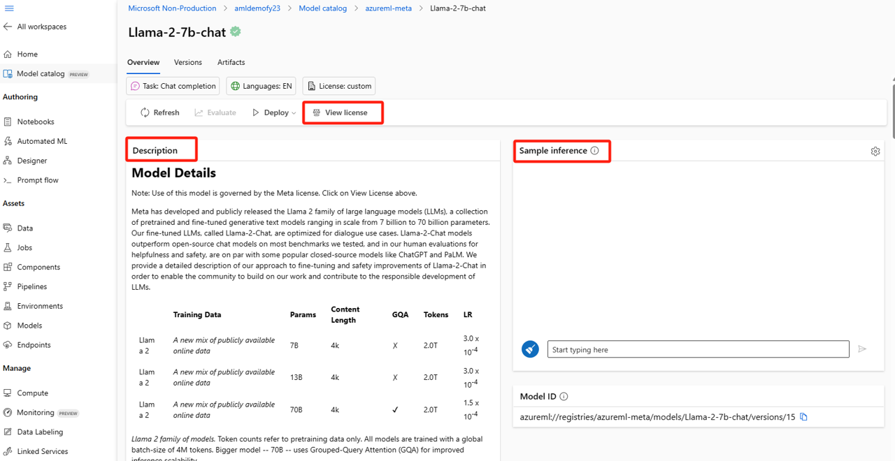

# Model as a Service: 在Azure 机器学习中使用Model Catalog部署开源模型

## 概述

本手册提供如何在 Azure 机器学习中访问、评估、微调基础模型，并将其部署到端点以进行推理的指南。

基础模型是机器学习模型，已在大量数据上进行了预训练，并且可以针对特定领域数据量相对较少的特定任务进行微调。这些模型可作为自定义模型的起点，并加速各种任务的模型构建过程，包括自然语言处理、计算机视觉、语音和生成式 AI 任务。Azure 机器学习提供了将这些预先训练的基础模型轻松集成到应用程序中的功能。Azure 机器学习中的基础模型提供 Azure 机器学习本机功能，使客户能够大规模发现、评估、微调、部署和操作开源基础模型。

## 如何在 Azure 机器学习中访问基础模型

Azure 机器学习工作室中的“模型目录”（预览版）是发现基础模型的中心。开源模型集合是由 Azure 机器学习策划的最常用开源基础模型的存储库。这些模型打包为开箱即用，并针对在 Azure 机器学习中使用进行了优化。目前，它包括顶级开源大型语言模型，即将支持其他任务。


您可以按任务或许可证筛选模型目录中的模型列表。选择特定模型名称，然后查看所选模型的模型卡，其中列出了有关模型的详细信息。例如：



## 部署基础模型示例

可以将基础模型（模型目录中的预训练模型，以及注册到工作区后的微调模型）部署到终结点，然后可用于推理。支持部署到实时终结点和批处理终结点。可以使用“部署 UI”向导或使用从模型卡链接的基于代码的示例来部署这些模型。

### 使用工作室进行部署

您可以通过单击任何基础模型的模型卡上的“部署”按钮，然后选择“实时终结点”或“批处理终结点”来调用部署 UI 向导

本示例以`OpenAI-CLIP-ViT-Base-Patch32`模型为例


- 选择`Real-time endpoint`部署实时终结点
- virtual Machine 选择默认配置 `Standard_D16a-v4`
- Instance count 改成`1`
- Endpoint Name 改成`openai-clip-vit-base-patch32-5`
- 其他选项均使用默认配置

部署配置如下，并单击`Deploy`


点击部署之后，需要等待几分钟时间，部署成功页面如下所示。


部署成功的模型，可以直接在UI上点击Test页面，进行测试。


测试时请参考模型描述中的Sample Input和Sample Out。


这里本教程随机搜索了两张图片：


在测试中添加了三个图片标签`egg, milk, juice`,让模型判断该图片属于哪一个label。

Test Input 如下：

```python
{
  "input_data": {
    "columns": [
      "image",
      "text"
    ],
    "index":[0, 1],
      "data":[
         ["https://th.bing.com/th/id/R.260b9960e4d8fc1daea549ffcb6aa082?rik=zhHUhb6ivH1MNA&riu=http%3a%2f%2foldfile.iyunshu.com%2fsupp%2fupload%2fday_160310%2f1457575151516623.jpg&ehk=lrQ6jq4UIPz%2fvXh%2bb1M6nPHrdjERDCBIqKFqI2%2bIGQs%3d&risl=&pid=ImgRaw&r=0", "egg, milk, juice"],
         ["https://www.bing.com/th?id=OSK.c64b263fd83aeb55fe819a98538f5236&w=402&h=459&c=7&rs=1&qlt=80&o=6&cdv=1&pid=16.1"]
      ]
  },
  "params": {}
}
```
响应的结果如下：
```json
[
  {
    "probs": [
      0.03371409326791763,
      0.9409568905830383,
      0.025329073891043663
    ],
    "labels": [
      "egg",
      "milk",
      "juice"
    ]
  },
  {
    "probs": [
      0.17487479746341705,
      0.041867371648550034,
      0.783257782459259
    ],
    "labels": [
      "egg",
      "milk",
      "juice"
    ]
  }
]
```
### 使用基于代码的示例进行部署

为了使用户能够快速开始部署和推理，我们在 [azureml-examples git 存储库](https://github.com/Azure/azureml-examples/blob/main/sdk/python/foundation-models/system/inference/zero-shot-image-classification/zero-shot-image-classification-online-endpoint.ipynb
)的推理示例中发布了示例。已发布的示例包括 Python 笔记本和 CLI 示例。也可以从每个模型overview tab中的inference参考，跳转到用于实时和批量推理的推理示例。

## 导入基础模型

如果要使用模型目录中未包含的开源模型，可以将模型从 Hugging Face 导入到 Azure 机器学习工作区中。Hugging Face 是一个用于自然语言处理 （NLP） 的开源库，它为流行的 NLP 任务提供预训练模型。目前，模型导入支持为以下任务导入模型，只要模型满足模型导入笔记本中列出的要求即可：

- fill-mask
- token-classification
- question-answering
- summarization
- text-generation
- text-classification
- translation
- image-classification
- text-to-image

您可以选择模型目录右上角的“导入（import）”按钮以使用模型导入笔记本。


模型导入笔记本也包含在此处的[azureml-examples git 存储库](https://github.com/Azure/azureml-examples/blob/main/sdk/python/foundation-models/system/import/import_model_into_registry.ipynb)中。

为了导入模型，您需要传入要从 Hugging Face 导入的模型。在 Hugging Face 应用中心浏览模型并确定要导入的模型。确保模型的任务类型属于支持的任务类型。复制模型 ID，该 ID 位于页面的 URI 中，也可以使用模型名称旁边的复制图标进行复制。将其分配给模型导入笔记本中的变量“MODEL_ID”。例如：MODEL_ID


## 注意事项

- Hugging Face 的模型受第三方许可条款的约束，使用时需遵守相应的许可条款。
- 部署基础模型到在线端点时，若计划不允许公网访问，请先进行模型打包（enable `Package Model`）

## 结束语

通过遵循本手册，用户可以在 Azure 机器学习中高效地访问、评估、微调基础模型，并将其部署到端点用于推理。

## 后续

### 微调基础模型

由于模型微调需要提前申请GPU quota，请提前确认Azure账号中GPU资源是否能够创建。

请参考[微调练习](https://learn.microsoft.com/zh-cn/training/modules/finetune-foundation-model-with-azure-machine-learning/)实现模型微调的动手实践。

[YouTube 视频指导](https://www.youtube.com/watch?v=IQrILl5B0kw) 中使用`bert-based-uncased`作为基础模型，结合[emotion数据集](https://huggingface.co/datasets/dair-ai/emotion)进行微调，可以参考视频中的训练，测试和评估流程，完成微调实验。


